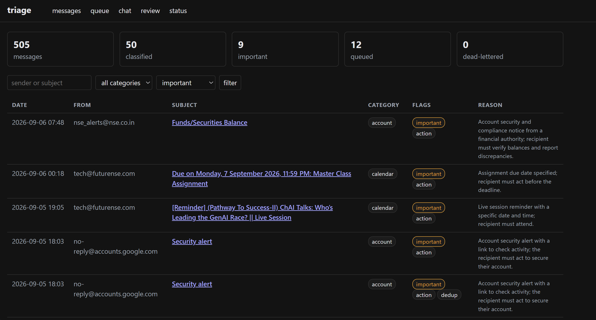
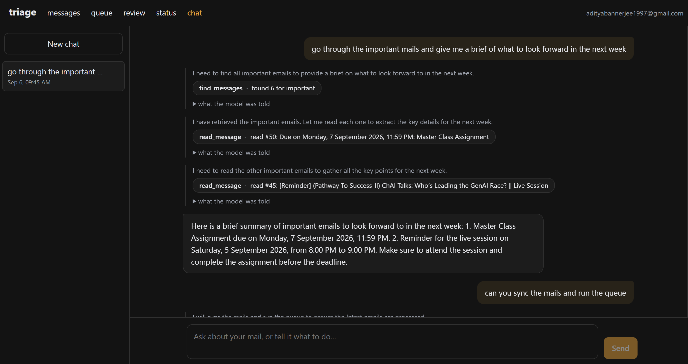

# email-triage

On-prem Gmail triage. Ingests one personal mailbox, classifies every message for
importance and category, extracts a few structured fields.

All inference is local. The only traffic this machine originates is the
authenticated Gmail API and IMAP calls needed to fetch mail.

---

## What is here

```
src/triage/
  config.py      pydantic-settings, everything from env
  taxonomy.py    the category enum -- single source of truth for the prompt,
                 the structured-output schema, and the review dropdown
  schemas.py     the Pydantic models db/repo.py returns
  db/            engine, ORM tables, the Postgres queue, every query
  ingest/        MailSource protocol + Gmail API, IMAP, OAuth, sync daemon
  parse/         MIME, HTML, dequoting, threading -- pure and deterministic
  pipeline/      runner (the ten stages), features, dedup, stage1_llm
  llm/           vLLM client, Triage schema, few-shot, embeddings, prompts/
  api/           FastAPI + Jinja + HTMX: review UI and operations console
  worker.py      LISTEN/NOTIFY worker
  scheduler.py   APScheduler jobs (hosted inside triage-sync)
  backfill.py    overnight IMAP import
eval/            golden set, scoring, report rendering
tests/           parse tests (no services) + queue tests (needs Postgres)
migrations/      Alembic
deploy/          systemd units and the vLLM environment file
```

Two modules exist that the handoff's tree did not list, both to avoid an import
cycle or an unwanted dependency:

- `llm/embeddings.py` -- the sentence-transformers wrapper. It had no home in
  the original tree and loading it lazily keeps several hundred MB of RSS out of
  the processes that never embed.
- `api/deps.py` -- the template environment and session dependency. The route
  modules cannot import `app.py` because `app.create_app()` imports them.
- `api/tasks.py` -- the console's queue runner and the OAuth consent thread.

`deploy/systemd/triage-worker.service` is shipped as `triage-worker@.service`,
a template, so that 2-4 instances run from one unit file.

---

## Bring it up

### Quick start

The whole stack, in order. Nothing here is destructive and everything is
idempotent, so this is also the sequence for restarting after a reboot.

```bash
# 1. Postgres. Wait for healthy before step 3.
docker compose up -d postgres
docker compose ps                       # STATUS should say (healthy)

# 2. vLLM on the Intel Arc. Slow to start: see the note below.
docker compose -f deploy/vllm-xpu.compose.yml up -d
docker compose -f deploy/vllm-xpu.compose.yml logs -f   # wait for "startup complete"

# 3. Schema. Creates nothing that already exists.
python -m alembic upgrade head

# 4. The chat UI. Only needed the first time, or after changing frontend/.
cd frontend && npm ci && npm run build && cd ..

# 5. The API.
PYTHONPATH=src python -m triage.api.app
```

Then open <http://127.0.0.1:8080>.

The 15-minute `start_period` on the healthcheck is sized for the worst case, so
`health: starting` says nothing about which case you are in -- read the log. Docker publishes port 8000 the instant
the container starts, so the port is *listening* long before vLLM is serving:
a request during that window is accepted and then dropped, which surfaces as

```bash
curl -s http://127.0.0.1:8000/v1/chat/completions -H "Content-Type: application/json"   -d '{"model":"Qwen3-8B-AWQ","messages":[{"role":"user","content":"say ok"}],
       "max_tokens":10,"chat_template_kwargs":{"enable_thinking":false}}'
```

### Checking it worked

```bash
curl -s http://127.0.0.1:8080/health | python -m json.tool      # bash
```
```powershell
Invoke-RestMethod http://127.0.0.1:8080/health | ConvertTo-Json -Depth 5
```

`database.ok` and `llm.ok` should both be true. `gmail.connected` reports the
*OAuth* token only, so it stays false on an App Password install even though
the mailbox is reachable -- `/queue` is the honest view of that one.

### Stopping

```bash
docker compose stop                                  # Postgres
docker compose -f deploy/vllm-xpu.compose.yml stop   # vLLM
```

`stop` keeps both volumes, so your mail and the model weights survive. `down -v`
would delete them; the only thing that makes that recoverable is that the mail
can be re-synced from Gmail and the weights re-downloaded.

## The tech stack

### 1. Postgres Database

```bash
docker compose up -d postgres
python -m alembic upgrade head
```

Use `127.0.0.1` rather than `localhost` in `DATABASE_URL`. On Windows,
`localhost` resolution against a Docker-published port can take over two
minutes per connection; on Linux it is merely one less thing to resolve.

### 2. Gmail

Two ways in, both driven from `/queue`. They are not equivalent, and the
difference is worth understanding before picking.

| | App Password (IMAP) | OAuth (Gmail API) |
| --- | --- | --- |
| Setup | ~1 minute | ~5 minutes, consent screen and all |
| Scope | whole mailbox, cannot be narrowed | `gmail.readonly` |
| Revocation | instant, in the Google account page | per-app, in account permissions |
| Credential on disk | a standing password | a refresh token |

**App Password** 
Turn on 2-Step Verification, generate a password at `myaccount.google.com/apppasswords`, paste
it into the console with your address. It is verified against Gmail before
being stored, so a typo fails at the point you made it rather than inside a
sync three steps later. Be clear-eyed about the trade: an App Password is a
standing credential with full mailbox access and no read-only variant. What it
has going for it is instant revocation — delete it and access dies immediately,
with no token to expire.

Either way, `python -m triage.ingest.auth` still does the OAuth flow from a
terminal if you prefer.

Three things that will bite otherwise:

- **Set the consent screen to "In production."** While it is in "Testing",
  refresh tokens expire after 7 days and the sync daemon dies quietly. Does not
  apply to App Passwords.
- Expect an "unverified app" interstitial on first consent. Click through.
  Verification only matters if this is distributed to other people.
- Refresh tokens carrying Gmail scopes are invalidated when the account
  password changes. `/status` shows a reconnect banner when that happens.

**IMAP scope caveat.** The steady-state daemon runs on `gmail.readonly`. Gmail's
IMAP XOAUTH2 mechanism is documented to require the full
`https://mail.google.com/` scope, so the backfill needs either that scope
(request it for the backfill run specifically, keeping the daemon on readonly)
or `IMAP_PASSWORD` set to an app password. Everything else works on readonly.

### 3. vLLM (On-Prem Inference)

Two supported deployments. Both serve `Qwen/Qwen3-8B-AWQ` on
`127.0.0.1:8000/v1` with guided JSON decoding, so nothing above `llm/client.py`
can tell them apart.

**Linux + NVIDIA** :

```bash
sudo cp deploy/systemd/vllm.service /etc/systemd/system/
sudo systemctl enable --now vllm            # reads deploy/vllm.env
```

**Windows + Intel Arc (XPU)**:

```powershell
docker compose --env-file deploy/vllm-xpu.env -f deploy/vllm-xpu.compose.yml up -d
docker compose -f deploy/vllm-xpu.compose.yml logs -f   # first start pulls 6.1 GB of weights
curl http://127.0.0.1:8000/v1/models
```

A container rather than a bare process, which is the opposite of what the
handoff asks for — but vLLM ships no Windows wheel and its XPU target
(`VLLM_TARGET_DEVICE=xpu`) is Linux-only, so this is the only route, not the
convenient one. The Arc reaches the container through WSL2's `/dev/dxg` plus
the `/usr/lib/wsl` mount, which is where `libdxcore.so` lives; Intel's Level
Zero runtime inside the image talks to that instead of a native kernel driver.
Confirm the passthrough before blaming vLLM for anything:

```powershell
docker compose -f deploy/vllm-xpu.compose.yml exec vllm `
  python3 -c "import torch; print(torch.xpu.get_device_name(0))"
```

### 4. The services

```bash
sudo cp deploy/systemd/triage-*.service /etc/systemd/system/
sudo systemctl enable --now triage-sync triage-api
sudo systemctl enable --now triage-worker@1 triage-worker@2
```

Five processes: `vllm`, `postgres`, `triage-sync`, `triage-worker` (2-4), and
`triage-api`. APScheduler runs inside `triage-sync` rather than as a sixth.

---

## The console

`/queue` is the operations surface. Everything on it is a plain POST that
returns the refreshed panel, so it works with or without htmx.



| Action | What it does |
| --- | --- |
| **Connect Gmail** | Runs the desktop OAuth flow in a background thread. A browser opens **on the machine running the API**, and the panel polls itself until the token lands. |
| **Sync mail now** | One `sync_once()` against the stored watermark — the same code the daemon and the hourly sweep call. |
| **Run entire queue** | Queues every unprocessed message, then drains it in-process. |
| **Process** (per row) | Queues that one message and starts the drain. |
| **Clear queue** | Deletes `pending` jobs. Never touches `running` ones — deleting a claimed job orphans the worker holding it. Messages are kept, so anything cleared can be re-queued. |
| **Retry dead-lettered** | Resets dead jobs to pending with `attempts = 0`. |

Two things worth understanding about it.

**"Unprocessed" is version-scoped.** It means *no judgment from the current
`model_id` + `prompt_version`*, not "no classification at all". Bump
`PROMPT_VERSION` and the whole mailbox becomes unprocessable again — which is
the point of versioning the prompt, and this is where you see it.

**The runner is not a second worker implementation.** It claims from the same
`jobs` table with the same `claim_one` and runs the same `run_job`, so you can
have `triage-worker` processes up at the same time and `SKIP LOCKED` keeps them
from colliding. It drains until the queue is empty and then stops, so "idle"
means idle. For continuous operation run `triage-worker` — that is what
LISTEN/NOTIFY is for. It is a button so that classifying one message does not
require a terminal.

---

## The chat agent

`/chat` is an agent over the same local model that classifies the mail. It has
fifteen typed tools -- search and read stored messages, and drive the queue --
and it emits one constrained JSON object per step through the same
`structured_outputs` path classification uses, because this vLLM runs without
`--enable-auto-tool-choice` and native tool calling is not available.



Two safeguards worth knowing:

**`clear_queue` and `dequeue_message` stop and ask.** The turn blocks on a
future until you click, or ten minutes pass. This is not decoration -- asked to
"put email 101 back in the queue", the model reached for `dequeue_message`,
the exact opposite, and the gate is what stopped it.

**A turn cannot be started while one is running**, process-wide. Two
simultaneous ~6k-token prompts against a 0.55 memory fraction is the one
contention case that reliably slows the classification pipeline down.

It is the only part of the app that is not server-rendered. A transcript has
real client state -- scroll position, a draft to keep, an autoscroll that must
not fight a user who scrolled up -- so it is a small React app:

```
cd frontend
npm ci          # first time
npm run build   # writes into src/triage/api/static/app/, which is gitignored
```

`/chat` returns 503 with that instruction until you do. `npm run dev` serves it
with hot reload and proxies `/api` to a running `triage-api`. The ops console at
`/queue` drives every one of these operations without JavaScript, so nothing
here is unreachable if the bundle does not load.